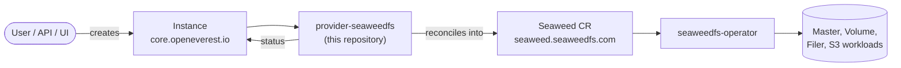

# SeaweedFS Provider

> [!WARNING]
> **MVP.** This provider is an early prototype. OpenEverest v2 and this provider are under
> active development. CRD schemas, chart values and defaults change frequently, including in
> breaking ways, and there is no supported upgrade path between versions yet. Not for
> production use.

<!-- Remove the MVP banner and the status badge when the provider leaves MVP. -->

[](https://github.com/openeverest/openeverest)
[](LICENSE)

Run **SeaweedFS** — distributed object storage with an S3-compatible gateway — on Kubernetes
through [OpenEverest](https://github.com/openeverest/openeverest), backed by the
[`seaweedfs-operator`](https://github.com/seaweedfs/seaweedfs-operator).

## What this is

OpenEverest providers translate a single, technology-agnostic `Instance` custom
resource into the native custom resources of an upstream Kubernetes operator —
for databases, but equally for caches, message queues, object storage, or
model-serving runtimes. This repository is the provider for **SeaweedFS**: it owns
the technology-specific knowledge — topologies, versions, and component layout —
so that users, the API server, and the UI stay technology-agnostic.

SeaweedFS is **not a database**. It is a distributed file system and object store
(masters, volume servers, filer, and an optional S3 gateway). This provider
provisions that stack; it does not manage relational or document data stores.

> [!IMPORTANT]
> **This provider is not standalone.** It requires an OpenEverest installation
> (core CRDs and controller) in the cluster. Installing this chart on its own
> does nothing. See [Install OpenEverest](https://openeverest.io/documentation/current/quick-install.html).



The provider watches `Instance` resources whose `spec.providerRef.name` is
`provider-seaweedfs`, and reports workload health back onto `Instance.status`.
It never manages pods directly — all lifecycle work is delegated to the operator.

## Compatibility

| provider-seaweedfs | OpenEverest | seaweedfs-operator | Kubernetes |
|---|---|---|---|
| `0.1.x` (MVP) | `>= 2.0.0` | `0.1.41` | `1.30` – `1.34` |

## Capabilities

What you can do to a running instance through the `Instance` API today. This is
an MVP: several capabilities are stubbed or not wired yet.

| Capability | Status | Notes |
|---|---|---|
| Provisioning | ✅ | Creates a `Seaweed` CR with master, volume, filer, and S3 components |
| Horizontal scaling | ✅ | Per-component `spec.components.*.replicas` |
| Vertical scaling (CPU / memory) | ❌ | Planned — resources are defined in the topology UI but not yet applied |
| Version selection | ✅ | `spec.version` / component image from [definition/versions.yaml](definition/versions.yaml) |
| High availability | ⚠️ | Replica counts are passed through; HA semantics are operator-dependent |
| Custom configuration | ❌ | Planned |
| Monitoring | ❌ | Planned |
| Pod scheduling (affinity) | ❌ | Planned |
| TLS | ❌ | Planned |
| Status / readiness | ⚠️ | Always reports provisioning — status mapping not implemented yet |
| Connection details | ❌ | No connection Secret published yet |

Stateful workloads additionally report:

| Capability | Status | Notes |
|---|---|---|
| Persistent storage | ✅ | `spec.components.volume.storage.size` (and filer storage in the topology UI) |
| Storage expansion | ❌ | Planned |
| Backups | ❌ | Not in scope for MVP |
| Restore | ❌ | Not in scope for MVP |

## Installation

Install from the chart in this repository (OCI publish is not set up for MVP yet):

```bash
make helm-deps
helm install provider-seaweedfs charts/provider-seaweedfs \
  --namespace everest-system \
  --create-namespace
```

- The `seaweedfs-operator` (and its CRDs) is bundled as a chart dependency and is
  installed automatically when `seaweedfs-operator.enabled` is `true` (the default).

Upgrade and uninstall:

```bash
helm upgrade provider-seaweedfs charts/provider-seaweedfs --namespace everest-system
helm uninstall provider-seaweedfs --namespace everest-system
```

Uninstalling the chart does **not** delete running `Instance` resources or their data.

## Usage

Verify that the provider registered itself:

```bash
kubectl get providers.core.openeverest.io provider-seaweedfs
```

Create an instance:

```yaml
apiVersion: core.openeverest.io/v1alpha1
kind: Instance
metadata:
  name: seaweedfs-standalone
spec:
  providerRef:
    name: provider-seaweedfs
  components:
    master:
      type: seaweedfs
      version: "4.47"
      image: chrislusf/seaweedfs:4.47
      replicas: 1
    volume:
      type: seaweedfs
      replicas: 1
      storage:
        size: 10Gi
    filer:
      type: seaweedfs
      replicas: 1
    s3:
      type: seaweedfs
      replicas: 1
```

Component names are defined by this provider — see
[definition/provider.yaml](definition/provider.yaml). `spec.version` and
`spec.topology` are optional; the provider defaults apply. More examples live in
[examples/](examples/).

Watch it come up:

```bash
kubectl get instance seaweedfs-standalone -w
kubectl get seaweed -A
```

> [!NOTE]
> Connection endpoints and credentials are **not** published on the `Instance`
> yet. Inspect the operator-managed Services and Pods for S3 / filer access
> until status mapping lands.

## Topologies

| Topology | Default | Description |
|---|---|---|
| `standalone` | ✅ | Single SeaweedFS deployment with master, volume, filer, and S3 gateway components |

## Versions

| Version bundle | Default | seaweedfs |
|---|---|---|
| `4.47` | ✅ | `4.47` (`chrislusf/seaweedfs:4.47`) |

Source of truth: [definition/versions.yaml](definition/versions.yaml).

## Configuration

- **Chart values:** [charts/provider-seaweedfs/values.yaml](charts/provider-seaweedfs/values.yaml)
- **Instance parameters:** per-component and per-topology schemas under
  [definition/](definition/), published on the `Provider` resource
  (`kubectl get provider provider-seaweedfs -o yaml`). The API server and the UI
  validate user input against these schemas.

MVP sync maps replica counts and volume storage size onto the upstream `Seaweed`
CR. Further knobs (resources, affinity, TLS, custom SeaweedFS options) are not
applied yet.

## Development

Requires Go (see [go.mod](go.mod)), Docker, Helm, kubectl, and a Kubernetes
cluster you can reach. For local development we recommend [k3d](https://k3d.io).

```bash
make k3d-cluster-up    # local k3d cluster
make generate          # RBAC, provider spec, Helm chart sync
make run               # run the provider locally against the cluster
make test              # unit tests
make helm-install      # install chart (+ seaweedfs-operator dependency)
make k3d-cluster-down
```

`make help` lists every target. `make verify` fails when generated files are
stale — run `make generate` and commit the result.

The provider contract (`Validate` / `Sync` / `Status` / `Cleanup`), RBAC
markers, watches, and code generation are documented once for all providers in
[PROVIDER_DEVELOPMENT.md](https://github.com/openeverest/provider-sdk/blob/main/PROVIDER_DEVELOPMENT.md).

### Layout

| Path | Purpose |
|---|---|
| `cmd/provider/` | Entry point |
| `internal/provider/` | `ProviderInterface` implementation, RBAC markers |
| `internal/common/` | Provider and component name constants |
| `definition/` | Provider identity, component types, versions, topologies |
| `charts/provider-seaweedfs/` | Helm chart (`generated/` is produced by `make generate`) |
| `config/rbac/role.yaml` | Generated `ClusterRole` — do not edit |
| `examples/` | Example `Instance` resources |
| `dev/` | k3d cluster config |

### Testing

- **Unit tests** — `make test`.
- **Integration tests** — Makefile target exists (`make test-integration`); suites are still being filled in for MVP.

## Troubleshooting

```bash
kubectl logs -n everest-system deploy/provider-seaweedfs -f
```

| Symptom | Where to look |
|---|---|
| `Instance` stuck in `Creating` | `kubectl describe instance <name>` conditions, then the provider logs. Status currently always reports provisioning. |
| No `Provider` resource in the cluster | Is the chart installed? Check the provider deployment logs |
| `Instance` ignored entirely | `spec.providerRef.name` must be `provider-seaweedfs` |
| `Seaweed` resource created but no pods | Inspect the `Seaweed` custom resource status — the failure is upstream in the operator |

## Contributing

Issues and pull requests are welcome. See
[PROVIDER_DEVELOPMENT.md](https://github.com/openeverest/provider-sdk/blob/main/PROVIDER_DEVELOPMENT.md)
and the [OpenEverest Code of Conduct](https://github.com/openeverest/openeverest/blob/main/CODE_OF_CONDUCT.md).

## Security

Report vulnerabilities per the [OpenEverest security policy](https://github.com/openeverest/openeverest/blob/main/SECURITY.md).
Please do not open public issues for security reports.

## License

Apache License 2.0 — see [LICENSE](LICENSE) for details.
