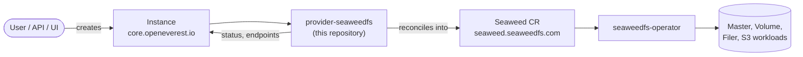

# SeaweedFS Provider

> [!WARNING]
> **MVP.** This provider is an early prototype. OpenEverest v2 and this provider are under
> active development. CRD schemas, chart values and defaults change frequently, including in
> breaking ways, and there is no supported upgrade path between versions yet. Not for
> production use.

<!-- Remove the MVP banner and the status badge when the provider leaves MVP. -->

[](https://github.com/openeverest/openeverest)
[](https://github.com/openeverest/provider-seaweedfs/actions/workflows/CI.yaml)
[](LICENSE)

Run **SeaweedFS** — distributed object storage with an S3-compatible gateway — on Kubernetes
through [OpenEverest](https://github.com/openeverest/openeverest), backed by the
[`seaweedfs-operator`](https://github.com/seaweedfs/seaweedfs-operator).

## What this is

OpenEverest providers translate a single, technology-agnostic `Instance` custom
resource into the native custom resources of an upstream Kubernetes operator —
for databases, but equally for caches, message queues, object storage, or
model-serving runtimes. This repository is the provider for **SeaweedFS**: it owns
the technology-specific knowledge — topologies, versions, and component layout —
so that users, the API server, and the UI stay technology-agnostic.

SeaweedFS is **not a database**. It is a distributed file system and object store
(masters, volume servers, filer, and an optional S3 gateway). This provider
provisions that stack; it does not manage relational or document data stores.

> [!IMPORTANT]
> **This provider is not standalone.** It requires an OpenEverest installation
> (core CRDs and controller) in the cluster. Installing this chart on its own
> does nothing. See [Install OpenEverest](https://openeverest.io/documentation/current/quick-install.html).


```mermaid
flowchart LR
    U([User / API / UI]) -->|creates| I["Instance<br/>core.openeverest.io"]
    I --> P["provider-seaweedfs<br/>(this repository)"]
    P -->|reconciles into| O["Seaweed CR<br/>seaweed.seaweedfs.com"]
    O --> W["seaweedfs-operator"]
    W --> R[("Master, Volume,<br/>Filer, S3 workloads")]
    P -->|status, endpoints| I
```

The provider watches `Instance` resources whose `spec.providerRef.name` is
`provider-seaweedfs`, and reports workload health back onto `Instance.status`.
It never manages pods directly — all lifecycle work is delegated to the operator.

## Compatibility

| provider-seaweedfs | OpenEverest | seaweedfs-operator | Kubernetes |
|---|---|---|---|
| `0.1.x` (MVP) | `2.0.0-dev.x` | `0.1.41` | `1.30` – `1.34` |

## Capabilities

What you can do to a running instance through the `Instance` API today. This is
an MVP: several capabilities are stubbed or not wired yet.

| Capability | Status | Notes |
|---|---|---|
| Provisioning | ✅ | Creates a `Seaweed` CR with master, volume, filer, and S3 components |
| Horizontal scaling | ✅ | Per-component `spec.components.*.replicas` (master must be odd) |
| Vertical scaling (CPU / memory) | ✅ | `spec.components.*.resources` |
| Version selection | ✅ | `spec.version` / component image from [definition/versions.yaml](definition/versions.yaml) |
| High availability | ⚠️ | Replica counts are passed through; HA semantics are operator-dependent |
| Custom configuration | ✅ | Master `masterVolumeSizeLimitMB`; volume `maxVolumeCounts` / `volumeServerDiskCount`; filer `maxMB`; S3 `port` / `domainName` / Ingress |
| S3 service exposure | ✅ | `spec.components.s3.service.serviceType`: ClusterIP, NodePort, or LoadBalancer |
| Monitoring | ❌ | Planned |
| TLS | ✅ | Inter-component gRPC mTLS via `topology.parameters.tls`. Client HTTPS via S3 Ingress TLS (`components.s3.parameters.ingress`) → `externalEndpointURL=https://…`. Native S3 HTTPS on the gateway is not supported by the operator yet ([seaweedfs-operator#411](https://github.com/seaweedfs/seaweedfs-operator/issues/411)) |
| Status / readiness | ✅ | Maps Seaweed Ready condition; waits for TLS Secret / LoadBalancer / Ingress when configured |
| Connection details | ✅ | Publishes in-cluster S3 endpoint on Ready; NodePort / LoadBalancer / Ingress add `externalEndpointURL` |
| Pod scheduling | ✅ | `schedulingPolicy` affinity, nodeSelector, tolerations and schedulerName. Master and volume pods require separate nodes by default; `affinity: {}` opts out. `topologySpreadConstraints` is rejected (no seaweedfs-operator field) |

Stateful workloads additionally report:

| Capability | Status | Notes |
|---|---|---|
| Persistent storage | ✅ | `spec.components.volume.storage.size` and `spec.components.filer.storage.size` (both required) |
| Storage expansion | ❌ | Planned |
| Backups | ❌ | Not in scope for MVP |
| Restore | ❌ | Not in scope for MVP |

## Installation

Install from the chart in this repository (OCI chart publish is not set up for MVP yet;
container images are published to GHCR on tagged releases):

```bash
make helm-deps
helm install provider-seaweedfs charts/provider-seaweedfs \
  --namespace everest-system \
  --create-namespace
```

- The `seaweedfs-operator` (and its CRDs) is bundled as a chart dependency and is
  installed automatically when `seaweedfs-operator.enabled` is `true` (the default).

Upgrade and uninstall:

```bash
helm upgrade provider-seaweedfs charts/provider-seaweedfs --namespace everest-system
helm uninstall provider-seaweedfs --namespace everest-system
```

Uninstalling the chart does **not** delete running `Instance` resources or their data.

## Usage

Verify that the provider registered itself:

```bash
kubectl get providers.core.openeverest.io provider-seaweedfs
```

Create an instance:

```yaml
apiVersion: core.openeverest.io/v1alpha1
kind: Instance
metadata:
  name: seaweedfs-standalone
spec:
  providerRef:
    name: provider-seaweedfs
  components:
    master:
      type: seaweedfs
      version: "4.47"
      image: chrislusf/seaweedfs:4.47
      replicas: 1
    volume:
      type: seaweedfs
      replicas: 1
      storage:
        size: 10Gi
    filer:
      type: seaweedfs
      replicas: 1
      storage:
        size: 1Gi
    s3:
      type: seaweedfs
      replicas: 1
```

Component names are defined by this provider — see
[definition/provider.yaml](definition/provider.yaml). `spec.version` and
`spec.topology` are optional; the provider defaults apply. More examples live in
[examples/](examples/), including [TLS](examples/seaweedfs-standalone-tls.yaml) and
[S3 Ingress](examples/seaweedfs-standalone-s3-ingress.yaml).

Enable inter-component mTLS (requires cert-manager):

```yaml
spec:
  topology:
    type: standalone
    parameters:
      tls:
        enabled: true
        # optional — omit for the operator's self-signed CA
        # issuerRef:
        #   name: my-ca-issuer
        #   kind: ClusterIssuer
```

Expose S3 outside the cluster (NodePort / LoadBalancer), or terminate client HTTPS
at an Ingress — see [examples/seaweedfs-standalone-s3-ingress.yaml](examples/seaweedfs-standalone-s3-ingress.yaml):

```yaml
spec:
  components:
    s3:
      type: seaweedfs
      replicas: 1
      service:
        serviceType: LoadBalancer   # or NodePort
      # parameters:
      #   ingress:
      #     enabled: true
      #     host: s3.example.com
      #     tls:
      #       secretName: seaweed-s3-tls
```

Watch it come up:

```bash
kubectl get instance seaweedfs-standalone -w
kubectl get seaweed -A
```

> [!NOTE]
> When the Instance is Ready, connection details are published to Secret
> `<instance-name>-conn` from the operator-managed S3 Service
> (`<name>-s3`). They include host, port, URI, and
> `forcePathStyle=true` / `verifyTLS=false` hints for S3 clients.
>
> **TLS note:** `topology.parameters.tls.enabled` turns on **gRPC mTLS between
> SeaweedFS components** (master/volume/filer/S3 gRPC). The S3 Service stays
> plain HTTP — in-cluster `endpointURL` remains `http://…` with `verifyTLS=false`.
>
> For **client-facing HTTPS**, enable S3 Ingress TLS
> (`spec.components.s3.parameters.ingress`). Connection details then publish
> `externalEndpointURL=https://<host>` and `externalVerifyTLS` (default `true`).
> See [examples/seaweedfs-standalone-s3-ingress.yaml](examples/seaweedfs-standalone-s3-ingress.yaml).
>
> NodePort and LoadBalancer also publish `externalEndpointURL` (HTTP) when the
> service is assigned. The Instance stays Provisioning until a LoadBalancer
> ingress address appears (or until the TLS Secret / Ingress exists when those
> are enabled).
>
> Inter-component mTLS requires cert-manager; without it the Instance stays
> Provisioning until the `<name>-server-tls` Secret appears.
>
> For Postgres backups, point a `BackupStorage` at that endpoint. Without an
> S3 identity config on the gateway, SeaweedFS accepts requests without auth —
> create any credentials Secret with `AWS_ACCESS_KEY_ID` /
> `AWS_SECRET_ACCESS_KEY` for BackupStorage to reference, create the bucket,
> then attach the storage to the Postgres Instance.
>
> ```yaml
> apiVersion: backup.openeverest.io/v1alpha1
> kind: BackupStorage
> metadata:
>   name: seaweedfs-backups
> spec:
>   type: s3
>   s3:
>     bucket: seaweedfs-standalone-backups
>     region: us-east-1
>     endpointURL: http://seaweedfs-standalone-s3.default.svc:8333
>     forcePathStyle: true
>     verifyTLS: false
>     credentialsSecretRef:
>       name: my-s3-creds
> ```

## Topologies

| Topology | Default | Description |
|---|---|---|
| `standalone` | ✅ | Single SeaweedFS deployment with master, volume, filer, and S3 gateway components |

## Versions

| Version bundle | Default | seaweedfs |
|---|---|---|
| `4.47` | ✅ | `4.47` (`chrislusf/seaweedfs:4.47`) |

Source of truth: [definition/versions.yaml](definition/versions.yaml).

## Configuration

- **Chart values:** [charts/provider-seaweedfs/values.yaml](charts/provider-seaweedfs/values.yaml)
- **Instance parameters:** per-component and per-topology schemas under
  [definition/](definition/), published on the `Provider` resource
  (`kubectl get provider provider-seaweedfs -o yaml`). The API server and the UI
  validate user input against these schemas.

MVP sync maps replica counts, resources, volume/filer/master persistence, S3
service exposure and Ingress, component parameters (`masterVolumeSizeLimitMB`,
`maxVolumeCounts`, `maxMB`, `port`, `domainName`), and optional TLS
(`topology.parameters.tls`) / JWT signing (`topology.parameters.securityConfig`)
onto the upstream `Seaweed` CR. Affinity and further SeaweedFS options are not
applied yet.

## Development

Requires Go (see [go.mod](go.mod)), Docker, Helm, kubectl, and a Kubernetes
cluster you can reach. For local development we recommend [k3d](https://k3d.io)
and [Tilt](https://tilt.dev/) — see [dev/README.md](dev/README.md).

```bash
make k3d-cluster-up    # local k3d cluster
make generate          # RBAC, provider spec, Helm chart sync
make run               # run the provider locally against the cluster
make test              # unit tests
make helm-install      # install chart (+ seaweedfs-operator dependency)
make dev-up            # k3d + Tilt (live-reload provider + OpenEverest)
make k3d-cluster-down
```

`make help` lists every target. `make verify` fails when generated files are
stale — run `make generate` and commit the result.

The provider contract (`Validate` / `Sync` / `Status` / `Cleanup`), RBAC
markers, watches, and code generation are documented once for all providers in
[PROVIDER_DEVELOPMENT.md](https://github.com/openeverest/provider-sdk/blob/main/PROVIDER_DEVELOPMENT.md).

### Layout

| Path | Purpose |
|---|---|
| `cmd/provider/` | Entry point |
| `internal/provider/` | `ProviderInterface` implementation, RBAC markers |
| `internal/common/` | Provider and component name constants |
| `definition/` | Provider identity, component types, versions, topologies |
| `charts/provider-seaweedfs/` | Helm chart (`generated/` is produced by `make generate`) |
| `config/rbac/role.yaml` | Generated `ClusterRole` — do not edit |
| `examples/` | Example `Instance` resources |
| `dev/` | k3d cluster config and Tilt setup |

### Testing

- **Unit tests** — `make test`.
- **Integration tests** — [chainsaw](https://kyverno.github.io/chainsaw/) suites in `test/integration/`. The seaweedfs-operator is scaled to 0 and the tests patch `Seaweed` status to simulate it, so they check the provider's mapping and status logic quickly. To run them locally:

  ```bash
  make k3d-cluster-up
  make docker-build load-image install-crds deploy-provider-ci IMG=provider-seaweedfs:ci
  # OpenEverest controller, built from an openeverest/openeverest checkout:
  (cd ../openeverest && make build-controller docker-build-controller)
  make load-openeverest-controller-image
  (cd ../openeverest && make deploy-test-controller)
  make test-integration            # or test-integration-core-standalone / -validation
  ```

## Troubleshooting

```bash
kubectl logs -n everest-system deploy/provider-seaweedfs -f
```

| Symptom | Where to look |
|---|---|
| `Instance` stuck in `Provisioning` | `kubectl describe instance <name>` conditions, then the provider logs. Common waits: Seaweed Ready, S3 Service, LoadBalancer ingress, S3 Ingress, or `<name>-server-tls` Secret when TLS is enabled |
| No `Provider` resource in the cluster | Is the chart installed? Check the provider deployment logs |
| `Instance` ignored entirely | `spec.providerRef.name` must be `provider-seaweedfs` |
| `Seaweed` resource created but no pods | Inspect the `Seaweed` custom resource status — the failure is upstream in the operator |
| TLS enabled but never Ready | Is [cert-manager](https://cert-manager.io) installed? Check for Certificate / Secret `<name>-server-tls` |

## Contributing

Issues and pull requests are welcome. See
[PROVIDER_DEVELOPMENT.md](https://github.com/openeverest/provider-sdk/blob/main/PROVIDER_DEVELOPMENT.md)
and the [OpenEverest Code of Conduct](https://github.com/openeverest/openeverest/blob/main/CODE_OF_CONDUCT.md).

## Security

Report vulnerabilities per the [OpenEverest security policy](https://github.com/openeverest/openeverest/blob/main/SECURITY.md).
Please do not open public issues for security reports.

## License

Apache License 2.0 — see [LICENSE](LICENSE) for details.
